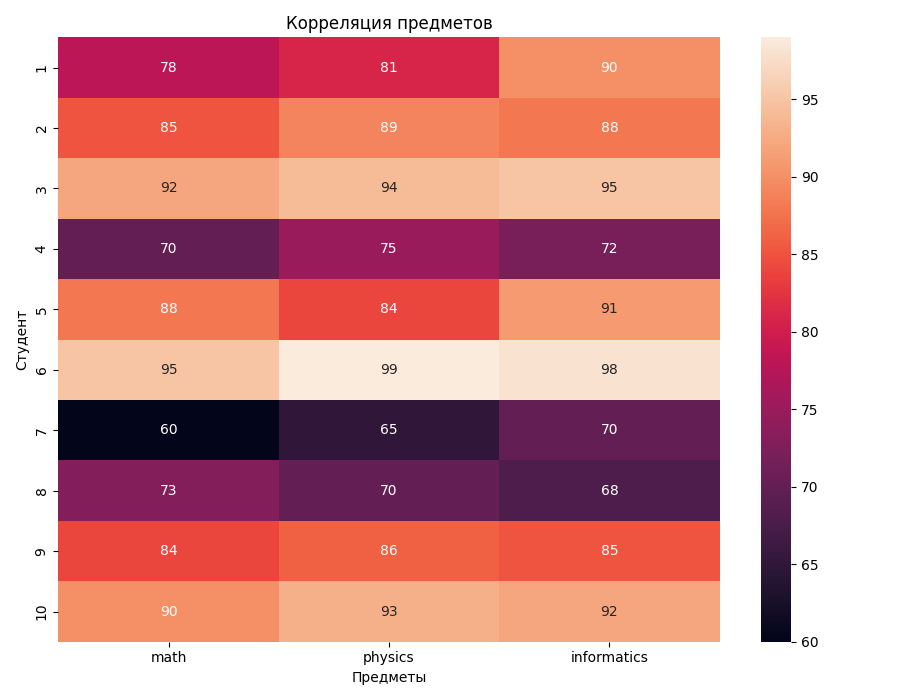
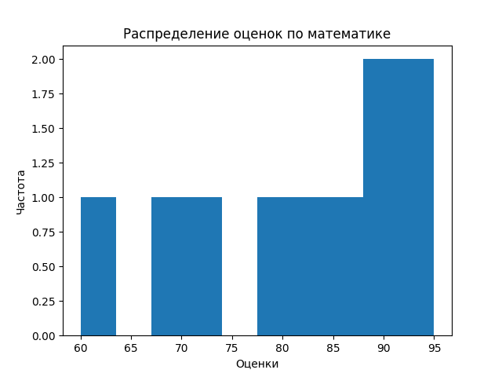
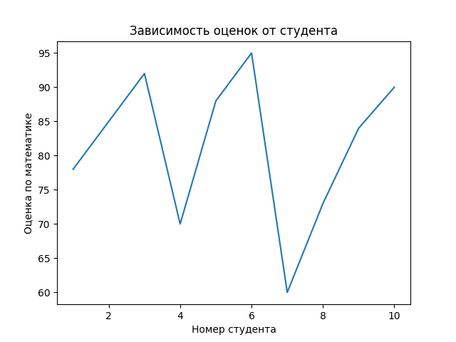

# Лабораторная работа 2: Основы NumPy: массивы и векторные операции

##  Цель работы

Изучить основные возможности библиотеки NumPy для численных вычислений и анализа данных: создание массивов, векторные и матричные операции, статистический анализ и визуализацию.

##  Задание

1. Реализовать функции для создания и обработки массивов
2. Выполнить векторные и матричные операции
3. Провести статистический анализ данных
4. Визуализировать результаты
5. Обеспечить соответствие кода стандартам PEP-8, наличие аннотаций типов и документации

##  Реализация

### Основные функции

#### Создание и обработка массивов
```python
def create_vector() -> np.ndarray:
    """Создать массив от 0 до 9"""
    return np.arange(10)

def create_matrix() -> np.ndarray:
    """Создать матрицу 5x5 со случайными числами [0,1]"""
    return np.random.rand(5, 5)

def reshape_vector(vec: np.ndarray) -> np.ndarray:
    """Преобразовать (10,) -> (2,5)"""
    return vec.reshape(2, 5)

def transpose_matrix(mat: np.ndarray) -> np.ndarray:
    """Транспонирование матрицы"""
    return np.transpose(mat)
```
Векторные операции
##### Нюанс: vector_add требует одинаковой формы массивов, иначе ValueError
```python 
def vector_add(a: np.ndarray, b: np.ndarray) -> np.ndarray:
    """Сложение векторов одинаковой длины"""
    return a + b

def scalar_multiply(vec: np.ndarray, scalar: Union[float, int]) -> np.ndarray:
    """Умножение вектора на число"""
    return vec * scalar

def elementwise_multiply(a: np.ndarray, b: np.ndarray) -> np.ndarray:
    """Поэлементное умножение"""
    return a * b

def dot_product(a: np.ndarray, b: np.ndarray) -> float:
    """Скалярное произведение"""
    return float(np.dot(a, b))  # Явное приведение к float
```
Матричные операции
##### Нюанс: для существования обратной матрицы важно, чтобы исходня матрица была невырожденной
```python 
def matrix_multiply(a: np.ndarray, b: np.ndarray) -> np.ndarray:
    """Умножение матриц"""
    return a @ b

def matrix_determinant(a: np.ndarray) -> float:
    """Определитель матрицы"""
    return float(np.linalg.det(a))

def matrix_inverse(a: np.ndarray) -> np.ndarray:
    """Обратная матрица"""
    return np.linalg.inv(a)

def solve_linear_system(a: np.ndarray, b: np.ndarray) -> np.ndarray:
    """Решить систему Ax = b"""
    return np.linalg.solve(a, b)
```
Статистический анализ данных
```python 
def load_dataset(path: str = "data/students_scores.csv") -> np.ndarray:
    """Загрузить CSV и вернуть NumPy массив"""
    return pd.read_csv(path).to_numpy()

# Баллы по математике
results: np.ndarray = load_dataset()
math_res: List[float] = []
for i in range(len(results)):
    math_res.append(float(results[i][0]))  # Явное приведение к float

def statistical_analysis(data: np.ndarray) -> Dict[str, float]:
    """Статистический анализ данных"""
    return {
        "mean": float(np.mean(data)),
        "median": float(np.median(data)),
        "std": float(np.std(data)),
        "min": float(np.min(data)),
        "max": float(np.max(data)),
        "25%": float(np.percentile(data, 25)),
        "75%": float(np.percentile(data, 75))
    }

def normalize_data(data: np.ndarray) -> np.ndarray:
    """Min-Max нормализация"""
    min_val: float = float(np.min(data))
    max_val: float = float(np.max(data))
    return (data - min_val) / (max_val - min_val)
```
Визуализация результатов
```python 
def plot_histogram(data: np.ndarray) -> None:
    """Построить гистограмму распределения оценок по математике"""
    plt.hist(data)
    plt.title("Распределение оценок по математике")
    plt.xlabel("Оценки")
    plt.ylabel("Частота")
    plt.savefig("plots/histogram.png")
    plt.close()
plot_histogram(math_res)

def plot_heatmap(matrix: np.ndarray) -> None:
    """Построить тепловую карту корреляции предметов"""
    fig, ax = plt.subplots(figsize=(9, 7))
    columns: List[str] = ['math', 'physics', 'informatics']
    rows: List[int] = [1, 2, 3, 4, 5, 6, 7, 8, 9, 10]
    sns.heatmap(matrix, annot=True, xticklabels=columns, yticklabels=rows, ax=ax)
    ax.set_xlabel("Предметы")
    ax.set_ylabel("Студент")
    plt.title("Корреляция предметов")
    plt.tight_layout()
    plt.savefig("plots/heatmap.png")
    plt.close()
plot_heatmap(load_dataset())

def plot_line(x: np.ndarray, y: np.ndarray) -> None:
    """Построить график зависимости: студент -> оценка по математике"""
    plt.plot(x, y)
    plt.title("Зависимость оценок от студента")
    plt.xlabel("Номер студента")
    plt.ylabel("Оценка по математике")
    plt.savefig("plots/line.png")
    plt.close()
plot_line(np.array([1,2,3,4,5,6,7,8,9,10]),math_res)
```
## Графики

### Тепловая карта корреляции предметов


### Гистограмма распределения оценок по математике


### График зависимости: студент -> оценка по математике


## Тесты
```python
import os
import numpy as np
import pandas as pd
import matplotlib.pyplot as plt
import matplotlib
matplotlib.use('Agg')
import seaborn as sns

from main import *

def test_create_vector():
    v = create_vector()
    assert isinstance(v, np.ndarray)
    assert v.shape == (10,)
    assert np.array_equal(v, np.arange(10))

def test_create_matrix():
    m = create_matrix()
    assert isinstance(m, np.ndarray)
    assert m.shape == (5, 5)
    assert np.all((m >= 0) & (m < 1))

def test_reshape_vector():
    v = np.arange(10)
    reshaped = reshape_vector(v)
    assert reshaped.shape == (2, 5)
    assert reshaped[0, 0] == 0
    assert reshaped[1, 4] == 9

def test_vector_add():
    assert np.array_equal(
        vector_add(np.array([1,2,3]), np.array([4,5,6])),
        np.array([5,7,9])
    )
    assert np.array_equal(
        vector_add(np.array([0,1]), np.array([1,1])),
        np.array([1,2])
    )

def test_scalar_multiply():
    assert np.array_equal(
        scalar_multiply(np.array([1,2,3]), 2),
        np.array([2,4,6])
    )

def test_elementwise_multiply():
    assert np.array_equal(
        elementwise_multiply(np.array([1,2,3]), np.array([4,5,6])),
        np.array([4,10,18])
    )

def test_dot_product():
    assert dot_product(np.array([1,2,3]), np.array([4,5,6])) == 32
    assert dot_product(np.array([2,0]), np.array([3,5])) == 6

def test_matrix_multiply():
    A = np.array([[1,2],[3,4]])
    B = np.array([[2,0],[1,2]])
    assert np.array_equal(matrix_multiply(A,B), A @ B)

def test_matrix_determinant():
    A = np.array([[1,2],[3,4]])
    assert round(matrix_determinant(A),5) == -2.0

def test_matrix_inverse():
    A = np.array([[1,2],[3,4]])
    invA = matrix_inverse(A)
    assert np.allclose(A @ invA, np.eye(2))

def test_solve_linear_system():
    A = np.array([[2,1],[1,3]])
    b = np.array([1,2])
    x = solve_linear_system(A,b)
    assert np.allclose(A @ x, b)

def test_load_dataset():
    test_data = "math,physics,informatics\n78,81,90\n85,89,88"
    with open("test_data.csv", "w") as f:
        f.write(test_data)
    try:
        data = load_dataset("test_data.csv")
        assert data.shape == (2, 3)
        assert np.array_equal(data[0], [78,81,90])
    finally:
        os.remove("test_data.csv")

def test_statistical_analysis():
    data = np.array([10,20,30])
    result = statistical_analysis(data)
    assert result["mean"] == 20
    assert result["min"] == 10
    assert result["max"] == 30

def test_normalization():
    data = np.array([0,5,10])
    norm = normalize_data(data)
    assert np.allclose(norm, np.array([0,0.5,1]))

def test_plot_histogram():
    data = np.array([1,2,3,4,5])
    plot_histogram(data)

def test_plot_heatmap():
    matrix = np.array([
        [1.0, 0.8, 0.3],
        [0.8, 1.0, 0.5],
        [0.3, 0.5, 1.0]
    ])
    plot_heatmap(matrix)
    assert os.path.exists("plots/heatmap.png"), "Файл heatmap.png не создан"

def test_plot_line():
    x = np.array([1,2,3])
    y = np.array([4,5,6])
    plot_line(x, y)

if __name__ == "__main__":
    print("Запуск через python -m pytest test.py -v для проверки лабораторной работы.")
```

### Нюанс с тестами: При запуске тестов без GUI: _tkinter.TclError: Can't find a usable tk.tcl
##### Решение: Добавить в начало:
```python
import matplotlib
matplotlib.use('Agg')
```

